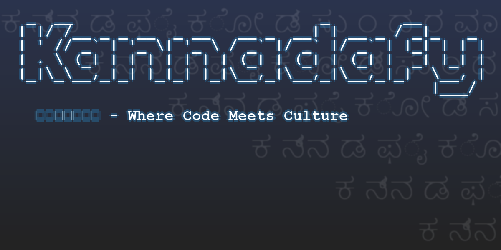

# 🎭 Kannadafy | ಕನ್ನಡಫೈ 🎭


<div align="center">
  

  <h1>🚀 Kannadafy v2.0.9 🚀</h1>
  <h3>ಸಾಫ್ಟ್‌ವೇರ್ ಮತ್ತು ಭಾಷೆಯ ಸಂಗಮ</h3>
  <p><i>Where Code Meets Culture</i></p>
</div>

**Kannadafy** transforms ordinary Python code into mysterious yet fully functional scripts using Kannada characters or themed wordlists. Your code keeps working exactly as before but appears as an elegant tapestry of linguistic art.

<div align="center">
  <table>
    <tr>
      <td align="center" width="100%">
        <h3>⚠️ IMPORTANT DISCLAIMER - VERSION 2.0.9 LIMITATIONS ⚠️</h3>
        <p>This version only supports <b>ONE-WAY TRANSFORMATION</b> (obfuscation).<br>
        Deobfuscation is not yet available and will be added in an upcoming release!</p>
        <p>⚠️ Once obfuscated, there is <b>NO WAY</b> to automatically recover your original code. ⚠️<br>
        <b>ALWAYS BACKUP YOUR ORIGINAL CODE BEFORE OBFUSCATION!</b></p>
      </td>
    </tr>
  </table>
</div>

---

## ✨ Magic in Action

<table>
<tr>
<th>Original Python</th>
<th>Kannadafied Code</th>
</tr>
<tr>
<td>

```python
print("Hello, World!")
```

</td>
<td>

```python
exec("".join(map(chr,[int("".join(str({'ಅ': 0,
 'ಅ:': 14,
 'ಅಂ': 13,
 'ಆ': 1,
 'ಇ': 2,
 'ಈ': 3,
 'ಉ': 4,
 'ಊ': 5,
 'ಋ': 6,
 'ಎ': 7,
 'ಏ': 8,
 'ಐ': 9,
 'ಒ': 10,
 'ಓ': 11,
 'ಔ': 12,
 'ಕ': 15,
 'ಖ': 16,
 'ಗ': 17,
 'ಘ': 18,
 'ಙ': 19,
 'ಚ': 20,
 'ಛ': 21,
 'ಜ': 22,
 'ಝ': 23,
 'ಞ': 24,
 'ಟ': 25,
 'ಠ': 26,
 'ಡ': 27,
 'ಢ': 28,
 'ಣ': 29,
 'ತ': 30,
 'ಥ': 31,
 'ದ': 32,
 'ಧ': 33,
 'ನ': 34,
 'ಪ': 35,
 'ಫ': 36,
 'ಬ': 37,
 'ಭ': 38,
 'ಮ': 39,
 'ಯ': 40,
 'ರ': 41,
 'ಲ': 42,
 'ಳ': 48,
 'ವ': 43,
 'ಶ': 44,
 'ಷ': 45,
 'ಸ': 46,
 'ಹ': 47}[i]) for i in x.split())) for x in
"ಆ ಆ ಇ  ಆ ಆ ಉ  ಆ ಅ ಊ  ಆ ಆ ಅ  ಆ ಆ ಋ  ಉ ಅ  ಈ ಉ  ಎ ಇ  ಆ ಅ ಆ  ಆ ಅ ಏ  ಆ ಅ ಏ \
 ಆ ಆ ಆ  ಉ ಉ  ಈ ಇ  ಏ ಎ  ಆ ಆ ಆ  ಆ ಆ ಉ  ಆ ಅ ಏ  ಆ ಅ ಅ  ಈ ಈ  ಈ ಉ  ಉ ಆ  ಆ ಅ"
.split("  ")])))
)
```

</td>
</tr>
</table>

---

## 🚀 Features

- **📜 Script Obfuscation**: Transform code with beautiful Kannada, Telugu, Tamil, Devanagari, or Greek scripts
- **🔤 Text-Based Obfuscation**: Use themed wordlists (food, animals, etc.) instead of scripts
- **📚 Multi-file Processing**: Batch transform entire projects with one command
- **🌍 Cross-Platform**: Works perfectly on Windows, macOS, and Linux
- **🧩 API Integration**: Import and use directly in your Python applications
- **🔄 Multiple Alphabets**: Choose from 5 different script systems
- **📝 Custom Text Templates**: Create your own themed wordlists for unique obfuscation styles
- **🔮 Coming Soon**: Deobfuscation support in the next major release!

---

## 💻 Quick Installation

```bash
# Via PyPI
pip install Kannadafy

# From source
git clone https://github.com/mithun50/Kannadafy.git
cd Kannadafy
pip install .
```

## 🖥️ Command-Line Usage

### Standard CLI Usage

```bash
# On Unix/Linux/macOS
Kannadafy obfuscate -i your_script.py -o obfuscated_output.py

# On Windows (or any platform as Python module)
python -m Kannadafy obfuscate -i your_script.py -o obfuscated_output.py
```

The Python module approach (`python -m Kannadafy`) works on all platforms and is especially useful on Windows or when you have multiple Python versions installed.

---

## 🧙‍♂️ Transformation Examples

### 1️⃣ Basic Kannada Obfuscation

```bash
Kannadafy obfuscate -i your_script.py -o obfuscated_output.py
```

**Real Example Output:**

<details>
<summary>Click to see real obfuscated output</summary>

```python
exec("".join(map(chr,[int("".join(str({'ಅ': 0, 'ಆ': 1, 'ಇ': 2, 'ಈ': 3, 'ಉ': 4, 'ಊ': 5, 'ಋ': 6, 'ಎ': 7, 'ಏ': 8, 'ಐ': 9}[i]) for i in x.split())) for x in
"ಅ ಇ ಊ  ಅ ಇ ಊ  ಅ ಇ ಊ  ಅ ಇ ಊ  ಅ ಅ ಉ  ಅ ಅ ಇ  ಅ ಅ ಇ  ಅ ಆ ಉ  ಅ ಆ ಆ  ಅ ಆ ಆ  ಅ ಆ ಉ  ಅ ಆ ಉ  ಅ ಆ ಇ  ಅ ಆ ಇ  ಅ ಆ ಉ  ಅ ಇ ಊ  ಅ ಅ ಋ  ಅ ಅ ಋ  ಅ ಅ ಋ  ಅ ಆ ಉ  ಅ ಆ ಆ  ಅ ಆ ಆ  ಅ ಆ ಇ  ಅ ಆ ಆ  ಅ ಆ ಉ  ಅ ಇ ಊ  ಅ ಈ ಋ"
.split("  ")]))
)
```

</details>

### 2️⃣ Food-Themed Obfuscation

```bash
Kannadafy text-obfuscate -i your_script.py -o food_themed.py -t patterns/food_words.txt
```

<details>
<summary>See the food-themed output (real example)</summary>

```python
exec("".join(map(chr,[int("".join(str({'pizza': 0, 'pasta': 1, 'burger': 2,
'taco': 3, 'sushi': 4, 'curry': 5, 'biryani': 6, 'noodles': 7, 'sandwich': 8,
'salad': 9, 'chocolate': 10, 'icecream': 11, 'cookie': 12, 'cake': 13,
'brownie': 14, 'muffin': 15, 'donut': 16, 'pancake': 17, 'waffle': 18,
'bread': 19, 'cheese': 20}[i]) for i in x.split())) for x in
"pizza burger curry  pizza burger curry  pizza burger curry  pizza burger curry
pizza pizza sushi  pizza pizza burger  pizza pizza burger  pizza pasta sushi
pizza pasta pasta  pizza pasta pasta  pizza pasta sushi  pizza pasta sushi
pizza pasta burger  pizza pasta burger  pizza pasta sushi  pizza burger curry
pizza pizza biryani  pizza pizza biryani  pizza pizza biryani  pizza pasta sushi
pizza pasta pasta  pizza pasta pasta  pizza pasta burger  pizza pasta pasta
pizza pasta sushi".split("  ")]))
)
```

</details>

### 3️⃣ Animal-Themed Obfuscation

```bash
Kannadafy text-obfuscate -i calculator.py -o animal_calc.py -t patterns/animal_pattern.txt
```

<details>
<summary>See the animal-themed output (real example)</summary>

```python
exec("".join(map(chr,[int("".join(str({'cat': 0, 'dog': 1, 'elephant': 2,
'tiger': 3, 'lion': 4, 'zebra': 5, 'giraffe': 6, 'monkey': 7, 'panda': 8,
'koala': 9, 'fox': 10, 'wolf': 11, 'bear': 12, 'deer': 13,
'rabbit': 14, 'squirrel': 15, 'mouse': 16, 'eagle': 17, 'dolphin': 18,
'penguin': 19, 'turtle': 20, 'crocodile': 21, 'snake': 22, 'frog': 23}[i]) for i in x.split())) for x in
"cat elephant zebra  cat cat tiger  cat cat lion  cat cat lion  cat cat giraffe
elephant tiger zebra  elephant zebra elephant  elephant zebra elephant
elephant zebra giraffe  tiger lion dog  tiger zebra lion  tiger giraffe zebra
tiger giraffe giraffe  lion dog tiger  lion dog zebra  lion dog giraffe
lion cat lion  lion elephant dog  lion elephant cat".split("  ")]))
)
```

</details>

### 4️⃣ Multi-file Processing

```bash
# Create output directory
mkdir obfuscated_project

# Obfuscate multiple files with different themes
Kannadafy multi-text-obfuscate -i script1.py script2.py script3.py -o obfuscated_project -t patterns/english_words.txt
```

### 5️⃣ Using Multiple Pattern Files

```bash
# Mix different themed wordlists
Kannadafy text-obfuscate -i script.py -o mixed_themed.py -t patterns/food_words.txt patterns/animal_pattern.txt
```

<details>
<summary>See mixed themed output (real example)</summary>

```python
exec("".join(map(chr,[int("".join(str({'pizza': 0, 'pasta': 1, 'burger': 2, 'taco': 3,
'sushi': 4, 'curry': 5, 'biryani': 6, 'noodles': 7, 'sandwich': 8, 'salad': 9,
'cat': 10, 'dog': 11, 'elephant': 12, 'tiger': 13, 'lion': 14, 'zebra': 15,
'giraffe': 16, 'monkey': 17, 'panda': 18, 'koala': 19}[i]) for i in x.split())) for x in
"pizza burger curry  pizza pizza taco  pizza pizza sushi  pizza pizza sushi
pizza pizza biryani  burger taco curry  burger curry burger  burger curry burger
burger curry biryani  taco sushi pasta  taco curry sushi  taco biryani curry
taco biryani biryani  cat dog elephant  cat dog tiger  cat dog lion
cat dog zebra  cat dog giraffe  cat dog monkey".split("  ")]))
)
```

</details>

### 6️⃣ Direct API Usage in Python

```python
from Kannadafy import obfuscate_api

# Simple obfuscation
obfuscate_api("input.py", "output.py")

# With text files
obfuscate_api("input.py", "output.py", text_files=["wordlists/movies.txt"])

# With custom script
obfuscate_api("input.py", "output.py", script_type="tamil")
```

### 7️⃣ Emoji-Themed Obfuscation

```bash
# Obfuscate with emojis
Kannadafy text-obfuscate -i examples/emoji_example.py -o emoji_obfuscated.py -t patterns/emoji_pattern.txt
```
